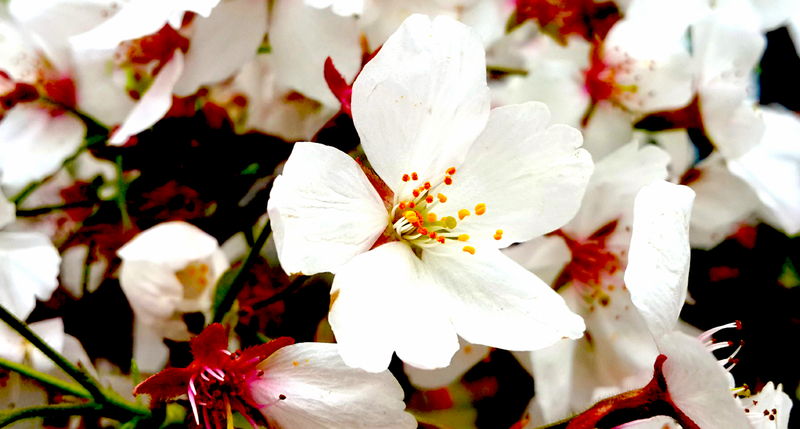
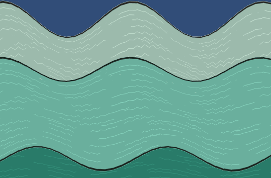

# LearnShaderBook
学习[Unity Shaders Book](https://github.com/candycat1992/Unity_Shaders_Book)时写的例子工程，这里作为效果展示用途。在学习时Unity推荐使用的是URP，所以全部Shader都是符合URP标准的，包括书里用到的很多函数，都改成了URP的写法。

## 第12章 屏幕后处理效果

屏幕后处理：亮度、饱和度及对比度

## 第11章 让画面动起来

  

纹理动画：序列帧动画与滚动背景

顶点动画：流动的河流

广告牌（Billboard）